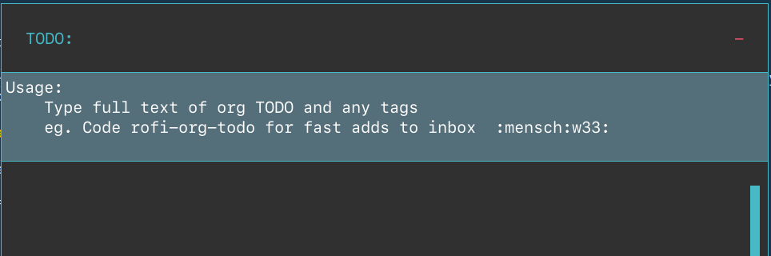

# Rofi Org TODO

## What is this?

If you use [Rofi](https://davedavenport.github.io/rofi/) on your desktop and [org-mode](https://orgmode.org/) TODOs in emacs, this is for you.

This code allows you to popup a fast window to quickly enter emacs org-mode `TODO`s into your system and having them formatting and appended onto an inbox file anywhere you specify on your system. This allows you to not break flow, throw it into your inbox for processing, and get back to what you were doing with minimal context switching and productivity loss.

It's a simple, understandable python script. Hotkey it. Then type the text of your todo plus tags and it appends the `TODO` into the specified file in proper `TODO` format with a proper `:PROPERTIES:` drawer and creation date for you. Easy peasy.

It's targeted to keyboard-driven GTD types, and for use on linux desktops i3 and PopOS (though, usable on any linux system rofi can handle.

## What's a Rofi?

[Rofi](https://davedavenport.github.io/rofi/) is a popup launcher, switcher and all-purpose runner with minimal dependencies. Its basic operation is to display a list of options, or allow text entry and let the user select something (it narrows things automatically as you type). If you've used Alfred on OSX (or Albert) it works very similarly to that but I find it an amazing swiss-army knife of a thing allowing much more flexibility and super easy customizing and scripting (what I've done here took me 30 minutes and filled a gap from what I used in Alfred in OSX before moving back over to linux.). Check it out if you're on Linux. It's the bomb and supports additional features such as an in-interface calc (including currency fx!) and a nifty clipboard and snippet manager.

## Installation

Take the file `rofi-org-todo.py` and stick it in your $PATH someplace, or do what I do with `rofi` scripts, and  a `./scripts` directory in `~/.config/rofi` and `chmod 700 rofi-org-todo.py` for the file to be executable.

Then simply alter the `inbox_file` line to point to your inbox or other file you want `TODO`s heading to for later processing. As long as it's in directories org-agenda cares about, it'll get sucked up and the `TODO`s into your org-agenda for refiling and action.

## i3 config

Add the following to your `~/.config/i3/config`

If you'd like to bind it to the Super+d key combo (you know, for *"Do"*):

```
bindsym $mod+d exec /home/your_name/.config/rofi/scripts/rofi-org-todo.py
```

Make sure to use the full path in the commands.

Use `Super+Shift+r` reload i3 to have it recognize the new keybinding (it'll throw an error if your new keybinding conflicts with anything else and you'll need to change your keys round.).

## POPOS (and other Gnome flavours)

Go into `Settings | Keyboard Shortcuts` from the POP Settings application 

I use the followi

> Name:     Rofi Org TODO
> Command:  /home/your_name/.config/rofi/scripts/rofi-todo-org.py
> Shortcut: Super+D

Make sure to use the full path to the file in the command.

## Usage

After that, hitting `Super+d` in our example should bring up a rofi popup window looking like this (depending on rofi theme):



Type in your TODO text (you do not need to type in TODO - we put the keyword in automatically for you in the file) and hit Enter and a new entry gets appended to your specified file.

My biggest hope that it helps you get done what you're trying to get done in your life.


## License: MIT License

*rofi-org-todo* is free software. You can redistribute it and/or modify it under the terms of the [MIT License](LICENSE).

## Contributing

It's so simple I'm not sure what I'd care to add, but feedback and suggestions are always welcome.

1. Fork it (<https://github.com/wakatara/rofi-org-todo/fork>)
2. Create your feature branch (`git checkout -b my-new-feature`)
3. Commit your changes (`git commit -am 'Add some feature'`)
4. Push to the branch (`git push origin my-new-feature`)
5. Create a new Pull Request

## Contributors

* [Daryl Manning](https://daryl.wakatara.com) - creator, maintainer, evil mastermind

